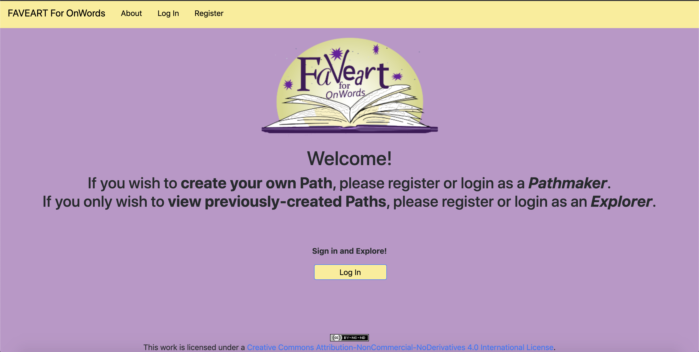
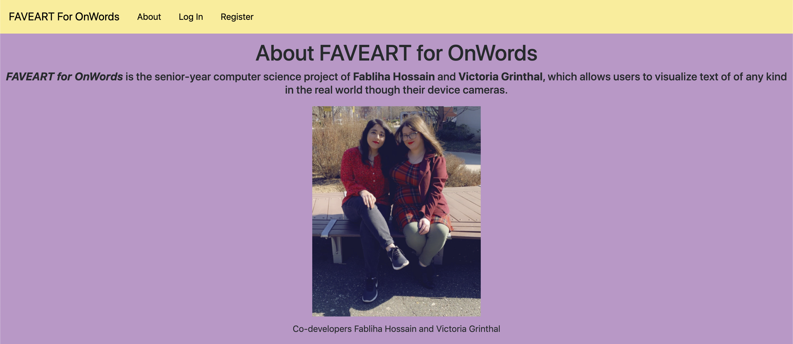

# FAVEART For OnWords 
## Spring 2020 Senior Seminar Project
### Fabliha and Victoria Explore Augmented Reality Technology for OnWords

**Project Objective:** The focus of this project is the showcase the importance of literature and history through animated text. We developed an Augmented Reality Web Application that allows educators, students, and creators to visualize text in the real world with any device that contains a rear-facing camera. With various cutomizable options, a user can create or explore a Path of text with AR Markers or Geographical Coordinates.

*Project URL:* https://faveart.profleune.net:5000/ 

#### A New User can register in the site with one of the following two roles: 
* **Pathmaker:** These are the users that can create a Path and its associating checkpoints. Each checkpoint contains a piece of text, a color, a font, and an animation. There are two types of Paths that can be created: Marker-Based and Geolocation. Based on the format chosen, there will be customizable fields to allow the Pathmaker to decide which marker or geoloation coordinates will be associated with each checkpoint in their path. Once the path is created, they can view those checkpoints with a default AR marker to get a display of how the text will appear for the explorers.

***We recommend that users who wish to create Paths use a laptop device in order to easily customize their checkpoints.***

* **Explorer**: These are the users that can access an entire path and view all checkpoints associated. Each Explorer must get the appropriate information from the Pathmaker if they wish to experience the Path to its full capability. When accessing the Paths, the explorers must enable their cameras for any Path to view the text. They must also allow for the site to detect their location in order to visualize the Geolocation Path.

***We recommend that the users who wish to explore Paths in the site use a device with a rear-facing camera, such as a smart phone or tablet.***

**How to Run the Site**: Currently, thanks to Professor Leune, the site is able to run on HTTPS on the Google Cloud Virtual Machine. This is a feature that's necessary in order to allow for the camera in the AR component. After obtaining the certificate details and the private key, the Flask environment must be activated in order to run the application. If one wishes to run the application on their local machines, after cloing the repository, they can simply execute the *flask run* command. Note that the database connection will need to be updated in this case. Additionally, without certificate details and private key, the application will only run on HTTP.

###### Technology Decisions:
* Python Flask
* PostgreSQL 
* Javascript
	* Leaflet
	* AFRAME
	* Bootstrap
* HTML 
* Google Cloud Console

**Special Thanks** to Shoshanah Tarkow and Professor Lee Stemkoski for bringing us the opportunity to develop this idea and for their support all throughout this semester.

**License Info:** This work is licensed under a Creative Commons Attribution-NonCommercial-NoDerivatives 4.0 International License. 